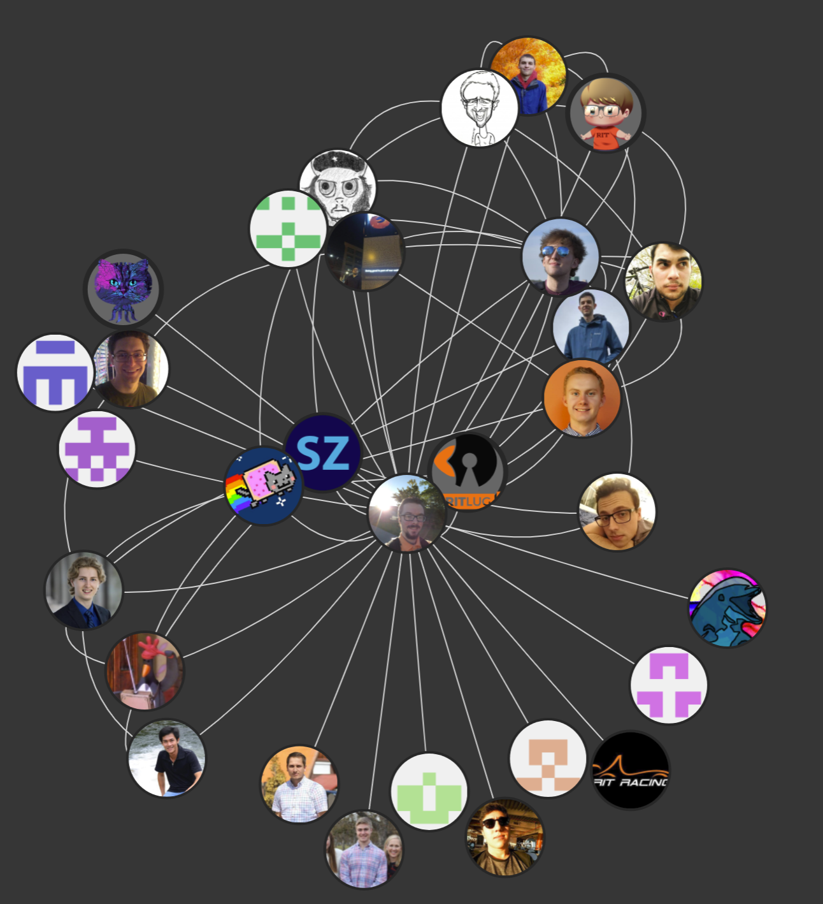

# Github-Graphs

Website for visualizing a persons github network.



If you are lucky, you can find the site live 
[here](https://github-graphs.com/);


# Built With

- [BootStrap](https://getbootstrap.com/) CSS Framework
- [jQuery](https://jquery.com/)
- [Vis JS](http://visjs.org/)
- [Github v3 API](https://developer.github.com/v3/) 
- [Node.js](https://nodejs.org/en/)


# Running

Update your conf.json file to contain your preferred port and github
api credentials.

```bash
npm install
```

```bash
node server.js
```


# Contributing

If you want to contribute to this project and don't know where to start,
look at the open issues. Once you know what you want to work on,
just discuss it in the issues and file a pull request. We are very open
to new contributes. 